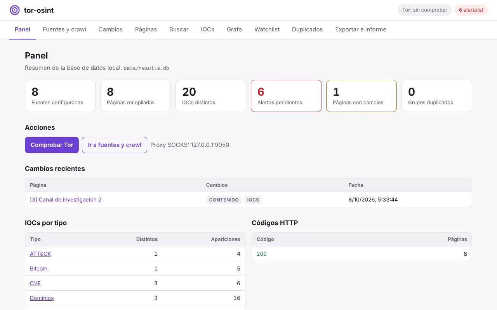
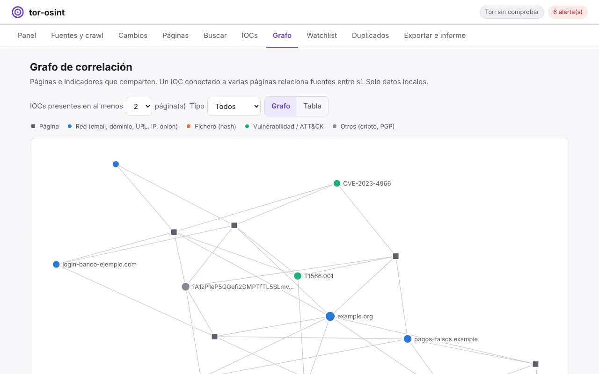
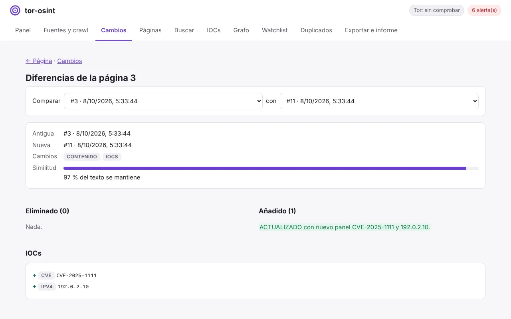
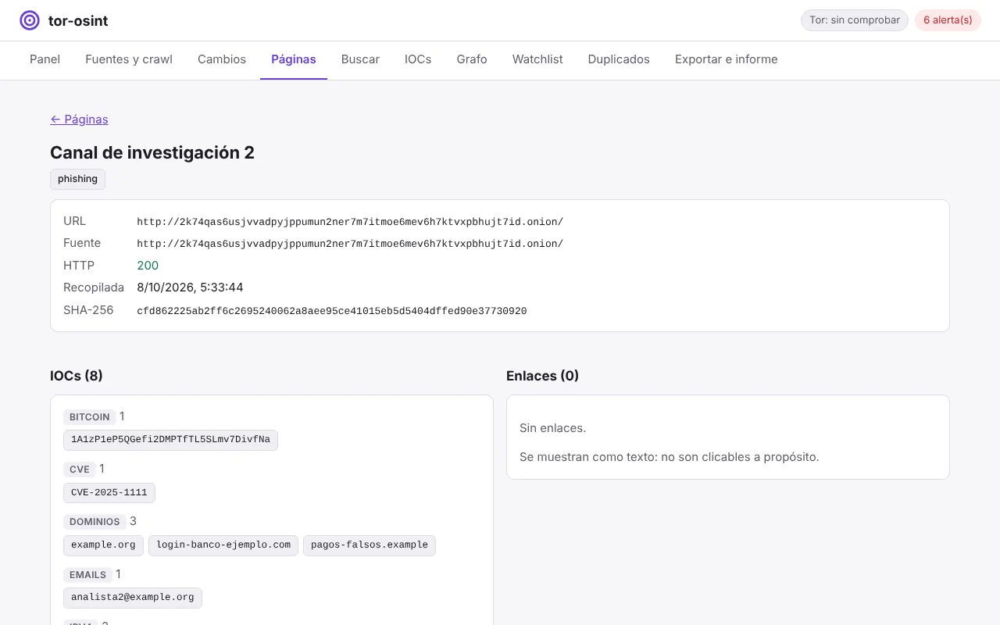
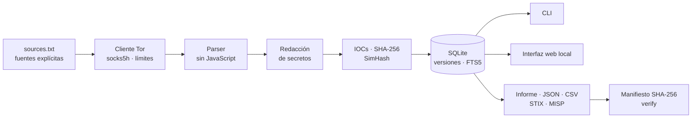

<p align="center">
  
</p>

<h1 align="center">tor-osint</h1>

<p align="center">
  <strong>Plataforma local de investigación OSINT para fuentes <code>.onion</code> que tú defines, siempre a través de Tor.</strong><br>
  Recopila, versiona, correlaciona y documenta, con cadena de custodia.
</p>

<p align="center">
  <a href="https://github.com/Marbi8891/tor-osint/actions/workflows/ci.yml"></a>
  <a href="https://github.com/Marbi8891/tor-osint/actions/workflows/codeql.yml"></a>
  <a href="https://github.com/Marbi8891/tor-osint/releases"></a>
  
  <a href="LICENSE"></a>
  <a href="https://github.com/astral-sh/ruff"></a>
  
  
</p>

<p align="center">
  <a href="#inicio-rápido">Inicio rápido</a> ·
  <a href="#características">Características</a> ·
  <a href="docs/MANUAL.md">Manual</a> ·
  <a href="SECURITY.md">Seguridad</a> ·
  <a href="CHANGELOG.md">Changelog</a>
</p>

<picture>
  <source media="(prefers-color-scheme: dark)" srcset="docs/images/panel-dark.webp">
  
</picture>

> [!IMPORTANT]
> **No es un crawler de la red Tor.** tor-osint solo consulta las fuentes que escribes en
> `data/sources.txt` (una petición por fuente), **no descubre servicios, no sigue enlaces y no
> interactúa** con ellos. Es una herramienta de laboratorio para investigación y aprendizaje sobre
> fuentes que tengas legitimidad para consultar.

## ¿Para qué sirve?

Seguir a mano un conjunto de fuentes en una investigación (foros, canales, paneles de una
campaña) deja notas dispersas y ninguna forma de saber **qué cambió** entre visitas ni **qué
indicadores comparten** las fuentes. tor-osint guarda cada visita como una versión, extrae y
normaliza los indicadores, te avisa cuando aparece lo que vigilas y genera evidencias que se
pueden verificar después.

## Características

|  |  |
|---|---|
| 🧅 **Solo fuentes explícitas** | Validación real de onion v3 (checksum), `socks5h`, límites de tamaño y tiempo, rate limiting y redirecciones solo hacia `.onion`. |
| 🔎 **13 tipos de IOC** | Emails, dominios, URLs, IPv4, MD5/SHA-1/SHA-256, CVE, onion, Bitcoin y Ethereum (con checksum), MITRE ATT&CK y huellas PGP. |
| 🕓 **Historial y cambios** | Cada crawl es una versión: diff por palabras, cambios de estado, título e indicadores. |
| 🔔 **Watchlist y alertas** | Vigila términos o IOCs; una alerta por versión de contenido, sin repeticiones. |
| 🧭 **Búsqueda y correlación** | Texto completo (FTS5), regex, `related`, grafo página ↔ IOC, duplicados (SHA-256) y casi duplicados (SimHash). |
| 🏷️ **Notas y etiquetas** | Anota páginas e indicadores durante la investigación. |
| 📦 **Exportación** | JSON, CSV, **STIX 2.1** (validado con la librería oficial de OASIS) y **MISP**, más un informe HTML autocontenido. |
| 🔐 **Cadena de custodia** | Manifiesto SHA-256 de cada evidencia, `verify` y registro de auditoría. |
| 🛡️ **Segura por defecto** | Credenciales redactadas antes de guardar, contenido remoto nunca ejecutado, interfaz solo en loopback con CSRF y CSP. |

<details>
<summary><strong>Más capturas</strong>: grafo de correlación, diff entre crawls y detalle de página</summary>
<br>

<picture>
  <source media="(prefers-color-scheme: dark)" srcset="docs/images/graph-dark.webp">
  
</picture>

<picture>
  <source media="(prefers-color-scheme: dark)" srcset="docs/images/diff-dark.webp">
  
</picture>

<picture>
  <source media="(prefers-color-scheme: dark)" srcset="docs/images/page-dark.webp">
  
</picture>

<sub>Capturas con datos de prueba ficticios.</sub>
</details>

## Inicio rápido

**Con Docker** (Tor incluido; desde el código):

```bash
git clone https://github.com/Marbi8891/tor-osint.git && cd tor-osint
docker compose up -d --build              # interfaz en http://127.0.0.1:8765/
docker compose run --rm cli tor-check     # comprueba que sales por Tor
```

Cada release publica también las imágenes en GitHub Container Registry
(`ghcr.io/marbi8891/tor-osint` y `ghcr.io/marbi8891/tor-osint-tor`).

**En Kali / Debian** (con el servicio `tor` del sistema):

```bash
sudo apt install -y tor python3-venv && sudo systemctl enable --now tor
git clone https://github.com/Marbi8891/tor-osint.git && cd tor-osint
python3 -m venv .venv && source .venv/bin/activate
pip install -e .
tor-osint tor-check
tor-osint web --open
```

## Un flujo típico

```bash
tor-osint sources --add http://<onion-v3>.onion/   # fuente validada (checksum v3)
tor-osint watch add term "acme"                    # vigila un término
tor-osint crawl                                    # una petición por fuente, por Tor
tor-osint changes                                  # ¿qué cambió desde el último crawl?
tor-osint alerts                                   # coincidencias nuevas de la watchlist
tor-osint related CVE-2024-3400                    # ¿dónde aparece este indicador?
tor-osint export --format stix                     # intercambio con otras herramientas
tor-osint report && tor-osint verify               # informe + verificación de integridad
```

Todos los comandos y opciones están en el [manual](docs/MANUAL.md#6-comandos).

## Cómo funciona



El orden importa: los secretos se redactan **antes** de extraer indicadores y calcular hashes,
así que ninguna credencial llega a la base de datos ni a las exportaciones. La arquitectura
completa, el esquema de datos y el modelo de seguridad están en el [manual](docs/MANUAL.md).

## Seguridad

- Todo el tráfico por Tor con resolución DNS remota; se ignoran los proxies del entorno.
- Contenido remoto siempre no confiable: sin JavaScript, sin renderizar, sin ejecutar.
- Interfaz web solo en loopback, con token CSRF, validación de `Host` y CSP sin `unsafe-inline`.
- Sin consultas externas automáticas (el CVSS se importa de un fichero de NVD que descargas tú).

¿Has encontrado un problema de seguridad? Repórtalo de forma privada: [SECURITY.md](SECURITY.md).

## Desarrollo

```bash
make install                   # pip install -e ".[dev]"
make check                     # lint + tests, igual que el CI (sin Tor ni red)
pre-commit install             # comprobaciones automáticas en cada commit
make help                      # resto de tareas (web, up, down, format, clean)
```

El CI ejecuta los tests en Python 3.10–3.13 y una prueba de extremo a extremo con Docker contra
la red Tor real, usando el servicio onion oficial de The Tor Project. Guía en
[CONTRIBUTING.md](CONTRIBUTING.md).

## Limitaciones

Extracción de IOCs y redacción heurísticas, sin JavaScript (las páginas que se generan en el
cliente aparecen vacías), interfaz web monousuario y local. Lista completa en el
[manual](docs/MANUAL.md#11-limitaciones).

## Comunidad

[Guía para contribuir](CONTRIBUTING.md) · [Código de conducta](CODE_OF_CONDUCT.md) ·
[Política de seguridad](SECURITY.md) · [Cómo citar](CITATION.cff)

## Licencia

[MIT](LICENSE) © Mrabeh Fathi
